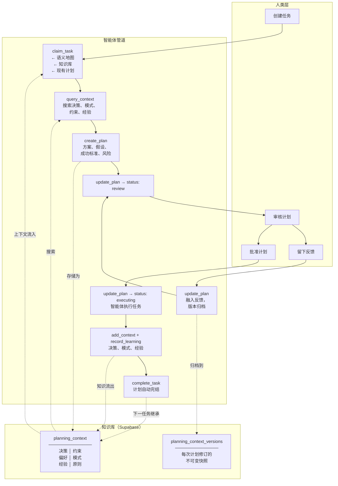

# CrowdListen Planner

> 让你的 AI 智能体从经验中学习，为智能体集群构建不断进化的上下文知识库。

[English](README.md) | [中文文档](README-CN.md)

## 亮点

1. **越用越聪明的智能体** — 每个任务都会捕获决策、模式和经验。下一个任务继承所有这些。
2. **上下文跨智能体流转** — 云端同步知识库。从 Claude Code 切换到 Cursor 再到 Gemini CLI —— 上下文始终跟随。
3. **计划作为一等工件** — 草案 → 审核 → 批准 → 执行 → 完成。版本化，支持人类反馈循环。
4. **多智能体协作** — 并行会话让多个智能体在共享上下文中协同处理同一任务。
5. **一条命令完成配置** — `npx @crowdlisten/planner login` 自动配置 5 个智能体。无需环境变量，无需编辑 JSON。

## 安装

```bash
npx @crowdlisten/planner login
```

一条命令。浏览器打开，登录 [CrowdListen](https://crowdlisten.com)，自动配置智能体。无需环境变量，无需 JSON，无需 API 密钥。

同时安装 [CrowdListen Insights](https://github.com/Crowdlisten/crowdlisten_insights)，获取跨渠道受众信号。

## 演示

https://github.com/user-attachments/assets/DEMO_VIDEO_ID

> 获取完整系统及更多功能，部署在 [crowdlisten.com](https://crowdlisten.com)

## 两个系统如何协作

```
┌──────────────────────────────────────────────────────────────────────────┐
│                        CrowdListen 生态系统                              │
│                                                                         │
│  ┌─────────────────────────────┐    ┌─────────────────────────────┐    │
│  │   CrowdListen Insights      │    │   CrowdListen Planner       │    │
│  │   (crowdlisten_insights)    │    │   (crowdlisten_tasks)       │    │
│  │                             │    │                             │    │
│  │   "用户在说什么？"           │    │   "我们应该构建什么？"       │    │
│  │                             │    │                             │    │
│  │  ┌───────────────────────┐  │    │  ┌───────────────────────┐  │    │
│  │  │  搜索 7 大平台        │  │    │  │  带上下文规划          │  │    │
│  │  │  提取评论              │  │    │  │  用智能体执行          │  │    │
│  │  │  聚类观点              │  │    │  │  捕获经验              │  │    │
│  │  │  分析情感              │  │    │  │  复合知识              │  │    │
│  │  └───────────────────────┘  │    │  └───────────────────────┘  │    │
│  │                             │    │                             │    │
│  │  Reddit · YouTube · TikTok  │    │  任务 → 计划 → 知识        │    │
│  │  Twitter · Instagram · 更多 │    │  云端同步，跨智能体流转    │    │
│  └──────────────┬──────────────┘    └──────────────┬──────────────┘    │
│                 │                                   │                   │
│                 │    ┌─────────────────────────┐    │                   │
│                 └───►│   你的 AI 智能体         │◄───┘                   │
│                      │   (Claude Code, Cursor,  │                       │
│                      │    Gemini CLI, Codex...) │                       │
│                      └─────────────────────────┘                       │
│                                                                         │
│                 npx @crowdlisten/planner login                          │
│                 一条命令安装两者。                                        │
└──────────────────────────────────────────────────────────────────────────┘
```

**Insights** 发现受众在各社交平台上的讨论。**Planner** 将这些信号转化为有计划、可追踪的工作 —— 上下文在每个任务间不断积累。两者配合，你的智能体可以研究话题、规划应对、执行任务，并记住所学以备下次使用。

## 功能介绍

AI 智能体的规划框架 —— 不是一个碰巧有计划功能的任务看板，而是一个碰巧有任务功能的规划系统。规划、获取反馈、带上下文执行、捕获经验，下一个任务就更智能。云端同步知识库意味着上下文跨智能体流转。

## 接口

| 接口 | 使用方式 | 适用场景 |
|------|---------|---------|
| **MCP** | 添加到智能体配置，智能体直接调用 20 个工具 | AI 智能体（Claude Code、Cursor、Gemini CLI 等） |
| **CLI** | `npx @crowdlisten/planner login/setup/logout/whoami` | 认证和智能体配置 |

MCP 服务器是主要接口 —— 智能体调用工具来管理任务、计划和知识。CLI 仅处理登录/配置。

## 核心工作流

```
list_tasks → claim_task → query_context → create_plan → [人工审核] → 执行 → record_learning → complete_task
```

1. **list_tasks** — 查看可用工作
2. **claim_task** — 开始工作，获取上下文（语义地图 + 知识库 + 现有计划）
3. **query_context** — 查询已有决策、模式、经验
4. **create_plan** — 起草方案、假设、风险、成功标准
5. **update_plan(status='review')** — 提交人工审核 → 人类批准或留下反馈
6. **执行** — 开展工作，沿途 log_progress，通过 add_context 记录决策
7. **record_learning** — 捕获经验（promote=true 提升为项目级可见）
8. **complete_task** — 标记完成，计划自动完结

计划是可选的。简单任务可以直接跳到执行。知识捕获仍然适用。

## 工具分类

### 核心工具（15个）

**任务管理：**
| 工具 | 功能 |
|------|------|
| `list_tasks` | 列出看板上的任务（首先调用） |
| `get_task` | 获取完整任务详情 |
| `create_task` | 创建新任务 |
| `update_task` | 更改标题、描述、状态、优先级 |
| `claim_task` | 开始工作 — 返回上下文、工作区、分支 |
| `complete_task` | 标记完成，自动完结计划 |
| `delete_task` | 永久删除任务 |
| `log_progress` | 记录执行会话日志 |

**规划：**
| 工具 | 功能 |
|------|------|
| `create_plan` | 创建执行计划（方案、假设、风险） |
| `get_plan` | 获取计划及版本历史和反馈 |
| `update_plan` | 迭代：更新方案、状态或添加反馈 |

**知识库：**
| 工具 | 功能 |
|------|------|
| `query_context` | 搜索决策、模式、经验 |
| `add_context` | 写入知识库 |
| `record_learning` | 捕获成果，可选提升为项目范围 |
| `get_or_create_global_board` | 获取全局看板 |

### 高级工具（3个） — 并行会话

| 工具 | 功能 |
|------|------|
| `start_session` | 启动并行智能体会话，支持多智能体协作 |
| `list_sessions` | 列出任务的会话 |
| `update_session` | 更新会话状态/焦点 |

### 管理工具（2个） — 看板管理

| 工具 | 功能 |
|------|------|
| `list_projects` | 列出可访问的项目 |
| `list_boards` | 列出项目的看板 |
| `create_board` | 创建带默认列的看板 |
| `migrate_to_global_board` | 将所有任务迁移到全局看板 |

完整参数详情：[docs/TOOLS.md](docs/TOOLS.md)

## 智能体接入

**方式一 — 一条命令（推荐）：**
```bash
npx @crowdlisten/planner login
```
打开浏览器，登录，自动为 7 个智能体配置 MCP。同时安装 Planner 和 Insights。

**方式二 — 手动配置：**
```json
{
  "mcpServers": {
    "crowdlisten/harness": {
      "command": "npx",
      "args": ["-y", "@crowdlisten/planner"]
    }
  }
}
```

**方式三 — 网页：**
在 [crowdlisten.com](https://crowdlisten.com) 登录。你的智能体可以阅读 [AGENTS.md](AGENTS.md) 获取工具参考。

## 架构



### 三层架构

```
┌─────────────────────────────────────────────────┐
│  知识库                                          │
│  决策、约束、模式、原则、                           │
│  经验 — 跨所有任务持久化                           │
├─────────────────────────────────────────────────┤
│  计划                                            │
│  一等工件，完整生命周期：                           │
│  草案 → 审核 → 批准 → 执行 → 完成                  │
├─────────────────────────────────────────────────┤
│  任务                                            │
│  可执行的工作单元，带状态追踪                        │
└─────────────────────────────────────────────────┘
```

## 智能体参考

查看 [AGENTS.md](AGENTS.md) 获取机器可读的功能描述、MCP 配置和示例工作流。

## 支持的智能体

**登录时自动配置：** Claude Code、Cursor、Gemini CLI、Codex、OpenClaw

**也支持（手动配置）：** Copilot、Droid、Qwen Code、OpenCode

## 命令

```bash
npx @crowdlisten/planner login    # 登录 + 自动配置智能体
npx @crowdlisten/planner setup    # 重新运行自动配置
npx @crowdlisten/planner logout   # 清除凭据
npx @crowdlisten/planner whoami   # 查看当前用户
```

## 开发

```bash
git clone https://github.com/Crowdlisten/crowdlisten_tasks.git
cd crowdlisten_tasks
npm install && npm run build
npm test    # 通过 Vitest 运行 210 个测试
```

## 许可证

MIT

获取完整系统及更多功能，部署在 [crowdlisten.com](https://crowdlisten.com)。
