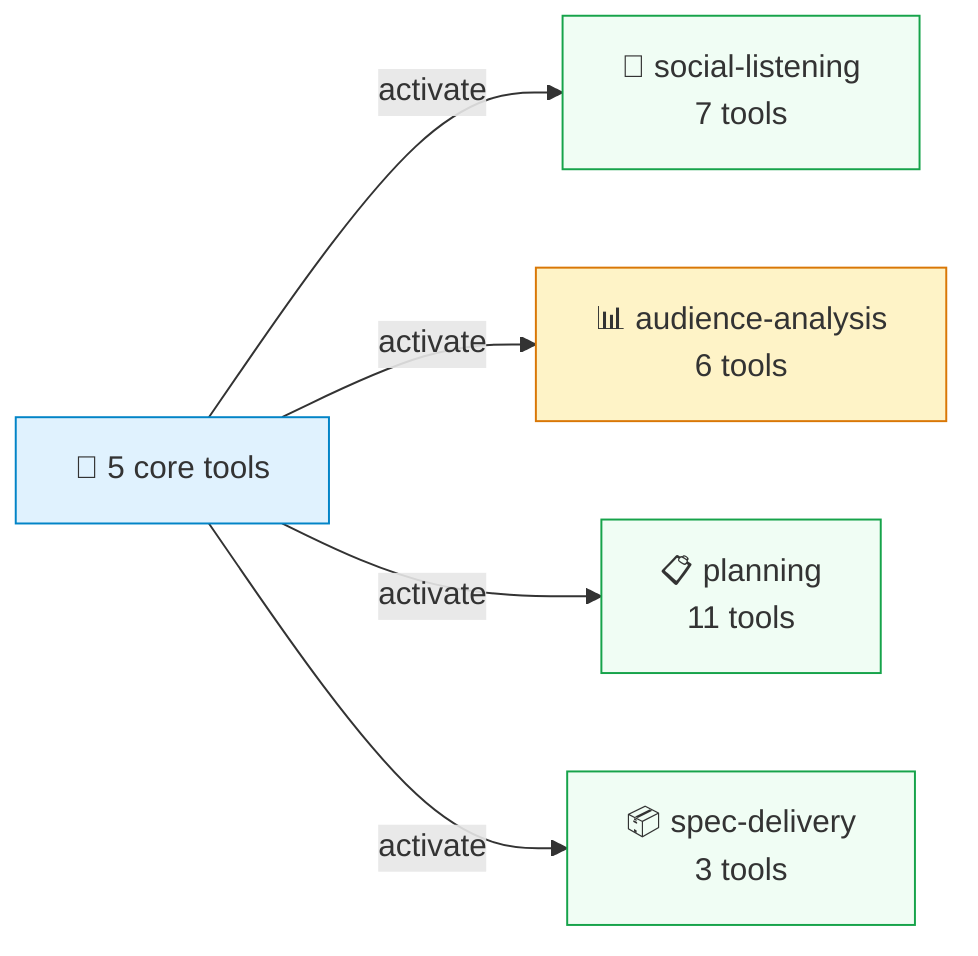
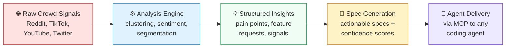

# CrowdListen

> CrowdListen le da a los agentes de IA contexto colectivo: inteligencia analizada sobre lo que dicen los usuarios reales, lo que piensan los mercados y lo que quieren las comunidades. No es simple memoria de sesion. Analizado, agrupado, listo para tomar decisiones.


[English](README.md) | [中文文档](README-CN.md) | [한국어](README-KO.md) | [Español](README-ES.md)

## El Problema

Los agentes de IA tienen memoria de sesion. No tienen contexto colectivo. Cada nueva sesion empieza desde cero, sin conocimiento de lo que tu audiencia esta diciendo en linea, sin senales analizadas de las plataformas donde los usuarios hablan de tu producto. Terminas re-explicando el contexto, copiando y pegando feedback de Reddit manualmente, y viendo a tu agente tomar decisiones sin el dato mas importante: lo que la gente real piensa.

CrowdListen cierra esta brecha con un ciclo de escucha, analisis y recuperacion:

1. **Escuchar** — buscar en Reddit, YouTube, TikTok, Twitter/X, Instagram, Xiaohongshu y foros
2. **Analizar** — agrupar opiniones por tema, extraer puntos de dolor, sintetizar reportes multi-plataforma
3. **Recordar** — guardar hallazgos analizados con embeddings semanticos, no publicaciones crudas
4. **Recuperar** — cualquier agente obtiene contexto colectivo via lenguaje natural, entre sesiones y dispositivos

```
search_content("cursor vs claude code", platform: "reddit")
→ 20 posts with engagement metrics

cluster_opinions(content_ids)
→ 4 opinion clusters: "Cursor better for refactoring" (38%), "Claude Code better for greenfield" (31%)

save({ title: "Dev tool preferences Q2", content: <clusters>, tags: ["competitive-intel"] })
→ Stored with semantic embedding

recall({ search: "what do developers think about our product vs competitors?" })
→ Returns analyzed clusters, ranked by semantic similarity
```

Cualquier agente — Claude Code, Cursor, Gemini CLI, Codex — puede usar `recall` despues. La inteligencia se acumula entre sesiones y entre agentes. Eso es contexto colectivo.

## Primeros Pasos

Un comando. Tu navegador se abre, inicias sesion y tus agentes se configuran automaticamente:

```bash
npx @crowdlisten/harness login
```

Esto auto-configura MCP para **Claude Code, Cursor, Gemini CLI, Codex, Amp y OpenClaw**. Sin variables de entorno, sin editar JSON, sin API keys que gestionar. Reinicia tu agente despues de iniciar sesion.

<details>
<summary><strong>Configuracion manual (stdio)</strong></summary>

```json
{
  "mcpServers": {
    "crowdlisten": {
      "command": "npx",
      "args": ["-y", "@crowdlisten/harness"]
    }
  }
}
```
</details>

<details>
<summary><strong>Configuracion remota (Streamable HTTP)</strong></summary>

```json
{
  "mcpServers": {
    "crowdlisten": {
      "url": "https://mcp.crowdlisten.com/mcp",
      "headers": {
        "Authorization": "Bearer YOUR_API_KEY"
      }
    }
  }
}
```

O auto-alojado: `npx @crowdlisten/harness serve` (inicia en el puerto 3848).
</details>

### Tu Agente Descubre Herramientas Progresivamente

Al iniciar, tu agente ve **5 herramientas base** — nada mas. Activa paquetes de habilidades bajo demanda, y solo carga las herramientas que necesita:



No se necesita reiniciar — los paquetes se activan via `tools/list_changed` y las nuevas herramientas aparecen al instante.

## Que Puedes Hacer

### Buscar en Plataformas Sociales

Busca en Reddit, YouTube, TikTok, Twitter/X, Instagram, Xiaohongshu y Moltbook desde una sola herramienta. Obtiene publicaciones estructuradas con metricas de engagement, timestamps e informacion del autor — mismo formato sin importar la plataforma.

```bash
# Also works as a CLI
npx crowdlisten search reddit "cursor vs claude code" --limit 5
npx crowdlisten vision https://news.ycombinator.com
```

### Analizar Senales de Audiencia

Agrupa opiniones, ejecuta analisis profundos (segmentos de audiencia, senales competitivas) y genera reportes de investigacion multi-plataforma desde una sola consulta. La extraccion base es gratuita y de codigo abierto.

### Guardar y Recuperar Entre Sesiones

Tu agente guarda contexto con `save` y lo recupera con `recall` usando busqueda semantica, no coincidencia de palabras clave. Pregunta "como deberiamos manejar la seguridad del login?" y encuentra tu nota anterior sobre tokens JWT — aunque las palabras no coincidan.

Las memorias persisten en Supabase con embeddings pgvector, asi que te siguen entre agentes y dispositivos. Si la API de embeddings no esta disponible, recurre a busqueda por palabras clave, y a almacenamiento local si Supabase esta caido.

### Planificar y Dar Seguimiento al Trabajo

Tu agente llama a `list_tasks` para ver que esta disponible, `claim_task` para empezar a trabajar, y `create_plan` para redactar un enfoque con supuestos y riesgos. Las decisiones y aprendizajes se guardan via `save`, para que tareas futuras puedan usar `recall`.

### Obtener Specs Accionables del Feedback Colectivo

El pipeline completo: el feedback colectivo se analiza, se extraen hallazgos y se generan specs automaticamente. Tu agente de desarrollo navega specs listas para implementar — cada una con evidencia de feedback real de usuarios, criterios de aceptacion y un puntaje de confianza.

### Extraer de Cualquier Sitio Web

El modo vision toma una captura de pantalla de cualquier URL, la envia a un LLM (Claude, Gemini u OpenAI) y devuelve datos estructurados. Un foro sin API? Un sitio de noticias con comentarios detras de un muro de pago? Solo apunta `extract_url` hacia el.

## Como Funciona




Cada paso alimenta al siguiente. Para cuando un agente de desarrollo llama a `get_specs`, la spec ya trae citas de evidencia de feedback real de usuarios, un puntaje de confianza y criterios de aceptacion derivados de los hallazgos.

## Paquetes de Habilidades

Tu agente comienza con 5 herramientas base y activa paquetes bajo demanda:

| Paquete | Herramientas | Que hace | Gratis? |
|---------|:------------:|----------|:-------:|
| **core** (siempre activo) | 5 | Memoria semantica, descubrimiento, preferencias | Si |
| **social-listening** | 7 | Buscar en Reddit, TikTok, YouTube, Twitter, Instagram, Xiaohongshu, Moltbook | Si |
| **audience-analysis** | 6 | Agrupacion de opiniones, analisis profundo, extraccion de hallazgos, sintesis de investigacion | API key |
| **planning** | 11 | Tareas, planes de ejecucion, seguimiento de progreso | Si |
| **spec-delivery** | 3 | Navegar y reclamar specs accionables del feedback colectivo | Si |
| **sessions** | 3 | Coordinacion multi-agente | Si |
| **analysis** | 5 | Ejecutar analisis completos, generar specs de resultados | API key |
| **content** | 4 | Ingerir contenido, busqueda vectorial | API key |
| **generation** | 2 | Generacion de PRD | API key |
| **llm** | 2 | Proxy gratuito de completado LLM | Si |
| **agent-network** | 3 | Registrar agentes, descubrir capacidades | Mixto |

Ademas, 8 **paquetes de flujo de trabajo** (competitive-analysis, content-strategy, market-research-reports, ux-researcher y mas) que entregan instrucciones metodologicas de expertos al activarse.

Referencia completa de herramientas con parametros: **[docs/TOOLS.md](docs/TOOLS.md)**

## Plataformas

**Funciona de inmediato** — Reddit

**Necesita Playwright** (`npx playwright install chromium`) — TikTok, Instagram, Xiaohongshu

**Necesita credenciales en `.env`:**
- Twitter/X — `TWITTER_USERNAME` + `TWITTER_PASSWORD`
- YouTube — `YOUTUBE_API_KEY`
- Moltbook — `MOLTBOOK_API_KEY`

**Modo vision** — necesita cualquiera de: `ANTHROPIC_API_KEY`, `GEMINI_API_KEY` u `OPENAI_API_KEY`

**Herramientas de analisis de pago** — `CROWDLISTEN_API_KEY` (las herramientas gratuitas funcionan sin ella)

## Privacidad

- PII redactada localmente antes de llamadas a LLM
- Memorias almacenadas en Supabase con seguridad a nivel de fila (los usuarios solo pueden acceder a sus propios datos)
- Respaldo local cuando Supabase no esta disponible
- Tus propias API keys para extraccion via LLM
- Ningun dato se sincroniza sin accion explicita del usuario
- Codigo abierto MIT e inspeccionable

---

<details>
<summary><strong>Comandos CLI</strong></summary>

```bash
npx @crowdlisten/harness login          # Sign in + auto-configure agents
npx @crowdlisten/harness setup          # Re-run auto-configure
npx @crowdlisten/harness logout         # Clear credentials
npx @crowdlisten/harness whoami         # Check current user
npx @crowdlisten/harness serve          # Start HTTP server on :3848
npx @crowdlisten/harness openapi        # Print OpenAPI 3.0 spec to stdout
npx @crowdlisten/harness context        # Launch skill pack dashboard
npx @crowdlisten/harness context <file> # Process file through context pipeline
npx @crowdlisten/harness setup-context  # Configure LLM provider for extraction

# Social listening CLI
npx crowdlisten search reddit "AI agents" --limit 20
npx crowdlisten comments youtube dQw4w9WgXcQ --limit 100
npx crowdlisten vision https://news.ycombinator.com --limit 10
npx crowdlisten trending reddit --limit 10
npx crowdlisten status
npx crowdlisten health
```
</details>

<details>
<summary><strong>Transportes</strong></summary>

| Transporte | Caso de uso | Comando |
|------------|-------------|---------|
| **stdio** (predeterminado) | Integracion local con agente | `npx @crowdlisten/harness` |
| **Streamable HTTP** | Acceso remoto/nube para agentes | `npx @crowdlisten/harness serve` |
| **OpenAPI/REST** | Cualquier cliente HTTP | `curl localhost:3848/openapi.json` |

El transporte HTTP corre en el puerto 3848 con autenticacion via `Authorization: Bearer <token>` (JWT de Supabase o API key). Health check en `GET /health`, spec OpenAPI en `GET /openapi.json`.
</details>

<details>
<summary><strong>Configuracion</strong></summary>

| Variable | Predeterminado | Descripcion |
|----------|----------------|-------------|
| `CROWDLISTEN_URL` | `https://crowdlisten.com` | URL del proyecto Supabase |
| `CROWDLISTEN_ANON_KEY` | Incluida | Clave anonima de Supabase |
| `CROWDLISTEN_APP_URL` | `https://crowdlisten.com` | URL de la app web (redirecciones de login) |
| `CROWDLISTEN_AGENT_URL` | `https://agent.crowdlisten.com` | URL del backend del agente |
| `CROWDLISTEN_API_KEY` | Ninguna | API key para herramientas de pago |
</details>

<details>
<summary><strong>Extraccion de Contexto</strong></summary>

Sube transcripciones de chat, obtiene bloques de contexto reutilizables y recomendaciones de habilidades. El PII se redacta localmente antes de que algo llegue a un LLM.

**Formatos soportados:** `.json` (exportaciones de ChatGPT/Claude), `.zip`, `.txt`, `.md`, `.pdf`

**Proveedores LLM:** OpenAI (gpt-4o-mini) o Anthropic (Claude Sonnet)
</details>

<details>
<summary><strong>Agentes Soportados</strong></summary>

**Auto-configurados al iniciar sesion:** Claude Code, Cursor, Gemini CLI, Codex, Amp, OpenClaw

**Tambien funciona con (configuracion manual):** Copilot, Droid, Qwen Code, OpenCode

CrowdListen auto-detecta cual agente esta corriendo via variables de entorno al llamar `claim_task`, `start_session` o `start_spec`.
</details>

## Desarrollo

```bash
git clone https://github.com/Crowdlisten/crowdlisten_harness.git
cd crowdlisten_harness
npm install && npm run build
npm test    # 210+ tests via Vitest
```

Para descripciones de capacidades legibles por agentes y ejemplos de flujos de trabajo, consulta [AGENTS.md](AGENTS.md).

## Contribuir

Las contribuciones de mayor valor: nuevos adaptadores de plataforma (Threads, Bluesky, Hacker News, Product Hunt, Mastodon) y correcciones de extraccion.

## Licencia

MIT — [crowdlisten.com](https://crowdlisten.com)
