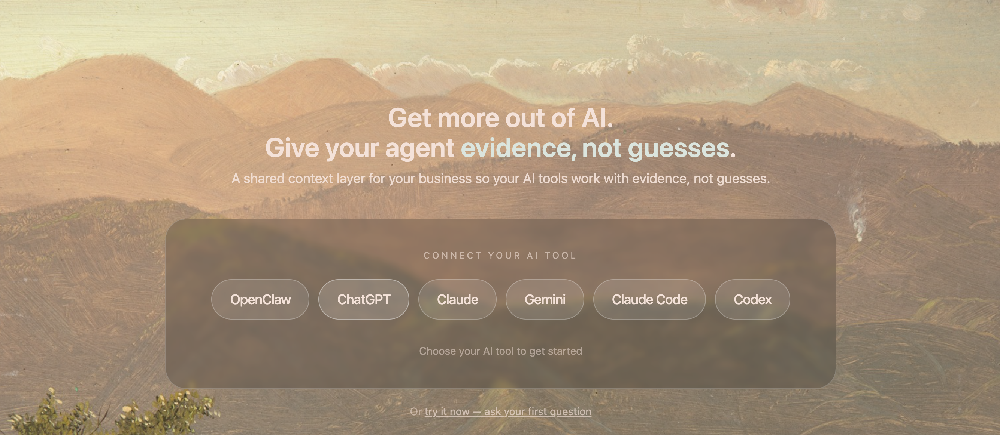
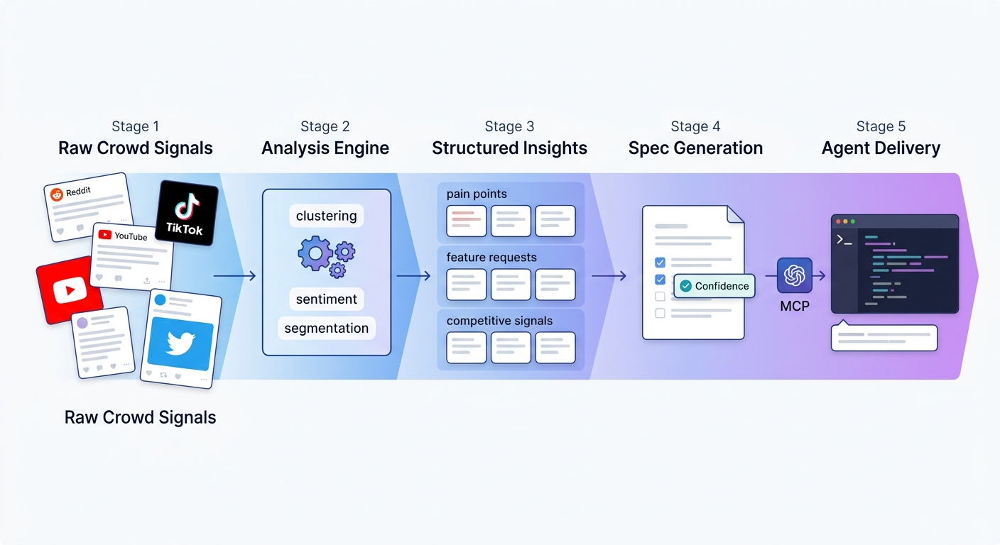

# CrowdListen

> Dale a tu agente de IA contexto colectivo — inteligencia analizada sobre lo que dicen los usuarios reales, lo que piensan los mercados y lo que quieren las comunidades.



[English](README.md) | [中文文档](README-CN.md) | [한국어](README-KO.md) | [Español](README-ES.md)

## El Problema

Los agentes de IA no saben lo que piensan tus usuarios. Cada sesion empieza desde cero — sin conocimiento de lo que la gente dice en Reddit, sin senales de comentarios de TikTok, sin sintesis de discusiones en foros. Terminas copiando y pegando feedback manualmente y viendo a tu agente tomar decisiones sin el dato mas importante: lo que la gente real piensa.

CrowdListen resuelve esto con un ciclo de cuatro pasos:

1. **Escuchar** — buscar en Reddit, YouTube, TikTok, Twitter/X, Instagram, Xiaohongshu y foros
2. **Analizar** — agrupar opiniones por tema, extraer puntos de dolor, sintetizar reportes multi-plataforma
3. **Guardar** — capturar hallazgos en una base de conocimiento .md que se acumula entre sesiones
4. **Recuperar** — cualquier agente obtiene contexto via busqueda semantica o navega INDEX.md directamente

Cualquier agente — Claude Code, Cursor, Gemini CLI, Codex — puede recuperar esto despues. La inteligencia se acumula entre sesiones y entre agentes. Eso es contexto colectivo.

## Primeros Pasos

Un comando. Tu navegador se abre, inicias sesion y tus agentes se configuran automaticamente:

```bash
npx @crowdlisten/harness login
```

Auto-configura MCP para **Claude Code, Cursor, Gemini CLI, Codex, Amp y OpenClaw**. Sin variables de entorno, sin editar JSON, sin API keys que gestionar. Reinicia tu agente despues de iniciar sesion.

### Configuracion Manual

Agrega a la configuracion MCP de tu agente:

```json
{
  "mcpServers": {
    "crowdlisten": {
      "command": "npx",
      "args": ["-y", "@crowdlisten/harness"]
    }
  }
}
```

Para acceso remoto, usa el transporte HTTP:

```json
{
  "mcpServers": {
    "crowdlisten": {
      "url": "https://mcp.crowdlisten.com/mcp",
      "headers": {
        "Authorization": "Bearer YOUR_API_KEY"
      }
    }
  }
}
```

## Que Puedes Hacer

| Capacidad | Que hace | Como funciona |
|-----------|----------|---------------|
| **Buscar en plataformas sociales** | Buscar en Reddit, YouTube, TikTok, Twitter/X, Instagram, Xiaohongshu desde una herramienta | Devuelve publicaciones estructuradas con metricas de engagement, timestamps e info del autor — mismo formato sin importar la plataforma |
| **Analizar senales de audiencia** | Agrupar opiniones, extraer puntos de dolor, generar reportes multi-plataforma | IA agrupa comentarios por tema, puntua sentimiento, identifica senales competitivas |
| **Guardar y recuperar entre sesiones** | Base de conocimiento .md que se acumula entre agentes y dispositivos | Tu agente guarda con `save`, recupera con `recall`, navega `~/.crowdlisten/context/INDEX.md`, organiza con `sync_context({ organize: true })` |
| **Planificar y dar seguimiento** | Tareas, planes de ejecucion, seguimiento de progreso, ejecucion en servidor | Tu agente reclama tareas, redacta planes con supuestos y riesgos, registra progreso, dispara ejecucion y consulta estado |
| **Ejecutar analisis completos** | Analisis colectivo de extremo a extremo con resultados en streaming | `run_analysis` dispara el pipeline completo en el backend; `continue_analysis` para seguimiento |
| **Obtener specs del feedback colectivo** | Convertir inteligencia colectiva en specs implementables | Las specs incluyen citas de evidencia, criterios de aceptacion y puntaje de confianza |
| **Extraer de cualquier sitio web** | Capturar pantalla de cualquier URL y obtener datos estructurados | El modo vision envia capturas a un LLM — funciona en foros, sitios de pago, cualquier URL |

## Como Funciona



Tu agente comienza con **7 herramientas base** y activa paquetes de habilidades bajo demanda (~30 herramientas en total). Sin reinicio — las nuevas herramientas aparecen al instante via `tools/list_changed`.

**Ejecucion de Tareas** — Dispara ejecucion de agentes IA en servidor (Amp, Claude Code, Codex, Gemini CLI) y consulta progreso via MCP. Llama `execute_task` para asignar trabajo y `get_execution_status` para rastrear completamiento.

### Paquetes de Habilidades

| Paquete | Herramientas | Que hace |
|---------|:------------:|----------|
| **core** (siempre activo) | 7 | Base de conocimiento .md (save/recall/sync/publish), descubrimiento de habilidades, preferencias |
| **social-listening** | 7 | Buscar en Reddit, TikTok, YouTube, Twitter, Instagram, Xiaohongshu |
| **audience-analysis** | 4 | Agrupacion de opiniones, extraccion de insights, enriquecimiento de contenido |
| **planning** | 13 | Tareas, planes de ejecucion, seguimiento de progreso, ejecucion de agentes en servidor |
| **analysis** | 5 | Ejecutar analisis completos, generar specs de resultados |
| **crowd-intelligence** | 2 | Investigacion colectiva asincrona con consulta de estado |
| **spec-delivery** | 3 | Navegar y reclamar specs accionables del feedback colectivo |
| **sessions** | 3 | Coordinacion multi-agente |
| **setup** | 3 | Gestion de tablero, lista de proyectos, migracion |
| **agent-network** | 2 | Registrar agentes, descubrir capacidades |

Ademas, 9 **paquetes de flujo de trabajo** que entregan metodologia experta via SKILL.md al activarse:
- knowledge-base, competitive-analysis, content-strategy, content-creator, data-storytelling, heuristic-evaluation, market-research-reports, user-stories, ux-researcher

Referencia completa de herramientas: **[docs/TOOLS.md](docs/TOOLS.md)**

### Base de Conocimiento

Cada interaccion del agente puede mejorar la base de conocimiento. El sistema funciona como un ciclo de interes compuesto:

```
 save()          Supabase              ~/.crowdlisten/context/
───────→  tabla memories  ──render──→  ├── INDEX.md
                                       ├── entries/a1b2c3d4.md
 recall()        ↑                     └── topics/auth.md
←────────────────┘
                                       sync_context({ organize: true })
 sync_context()                        detecta duplicados,
 reconstruye  ←──── pull completo ──── agrupa por tema,
 cache .md local                       sugiere sintesis
```

**Flujo de datos:**

1. **Guardar** — `save({ title, content, tags })` escribe en Supabase y renderiza un archivo `.md` local con frontmatter YAML
2. **Recuperar** — `recall({ search })` consulta Supabase via busqueda semantica (similitud coseno pgvector), con fallback a palabras clave. Para navegacion estructurada, los agentes leen `~/.crowdlisten/context/INDEX.md` directamente
3. **Sincronizar** — `sync_context()` extrae todas las entradas de la nube y reconstruye toda la carpeta `.md` local. Usar despues de subir desde web o cambiar de maquina. Pasar `organize: true` para detectar casi-duplicados (similitud Jaccard), identificar temas con 3+ entradas, y devolver un reporte indicando que sintetizar o podar
4. **Publicar** — `publish_context({ memory_id, team_id })` comparte una entrada con companeros. Su proximo `sync_context` la incluye en la seccion `## Shared` de su INDEX.md

**El efecto compuesto:** Despues de cada tarea de analisis o investigacion, el agente guarda 2-3 puntos clave. Con el tiempo, `sync_context({ organize: true })` los agrupa en temas. El agente sintetiza temas en resumenes destilados. El siguiente agente empieza con un INDEX.md rico en lugar de una pagina en blanco.

Supabase es la fuente de verdad. La carpeta `.md` local es un cache renderizado de solo lectura — sin conflictos de sincronizacion, sin problemas de merge.

### Plataformas

| Plataforma | Configuracion | Notas |
|------------|---------------|-------|
| Reddit | Ninguna | Funciona inmediatamente |
| TikTok, Instagram, Xiaohongshu | `npx playwright install chromium` | Extraccion basada en navegador |
| Twitter/X | `TWITTER_USERNAME` + `TWITTER_PASSWORD` en `.env` | Basado en credenciales |
| YouTube | `YOUTUBE_API_KEY` en `.env` | API key requerida |
| Modo vision (cualquier URL) | Cualquiera de: `ANTHROPIC_API_KEY`, `GEMINI_API_KEY`, u `OPENAI_API_KEY` | Capturas + extraccion LLM |

### Agentes Soportados

**Auto-configurados al iniciar sesion:** Claude Code, Cursor, Gemini CLI, Codex, Amp, OpenClaw

**Tambien funciona con (config manual):** Copilot, Droid, Qwen Code, OpenCode

## CLI

```bash
npx @crowdlisten/harness login          # Iniciar sesion + auto-configurar agentes
npx @crowdlisten/harness setup          # Re-ejecutar auto-configuracion
npx @crowdlisten/harness serve          # Iniciar servidor HTTP en :3848

npx crowdlisten search reddit "AI agents" --limit 20
npx crowdlisten vision https://news.ycombinator.com --limit 10
npx crowdlisten trending reddit --limit 10
```

## Privacidad

- PII redactada localmente antes de llamadas a LLM
- Memorias almacenadas con seguridad a nivel de fila — usuarios solo pueden acceder a sus propios datos
- Fallback local cuando la nube no esta disponible
- Tus propias API keys para extraccion via LLM
- Ningun dato se sincroniza sin accion explicita
- MIT open-source e inspeccionable

## Desarrollo

```bash
git clone https://github.com/Crowdlisten/crowdlisten_harness.git
cd crowdlisten_harness
npm install && npm run build
npm test    # 210+ tests via Vitest
```

Para descripciones de capacidades legibles por agentes y ejemplos de flujos de trabajo, consulta [AGENTS.md](AGENTS.md).

## Contribuir

Las contribuciones de mayor valor: nuevos adaptadores de plataforma (Threads, Bluesky, Hacker News, Product Hunt, Mastodon) y correcciones de extraccion.

## Licencia

MIT — [crowdlisten.com](https://crowdlisten.com)
