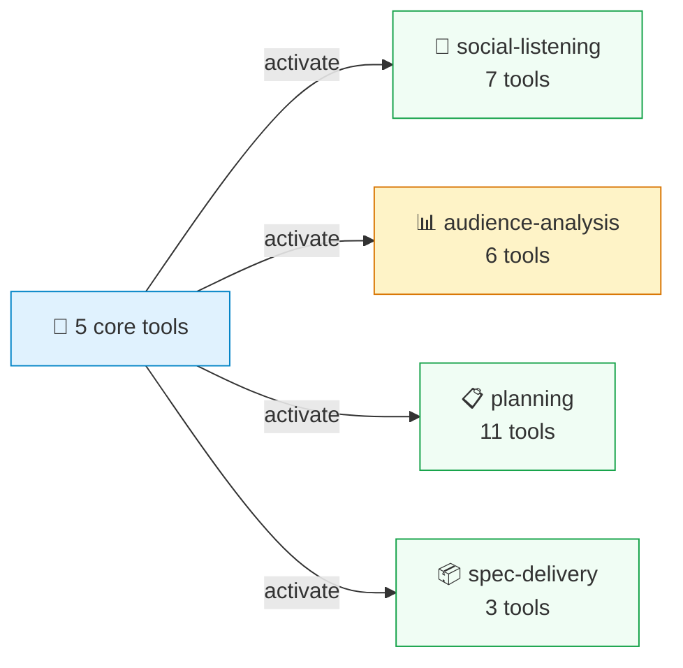
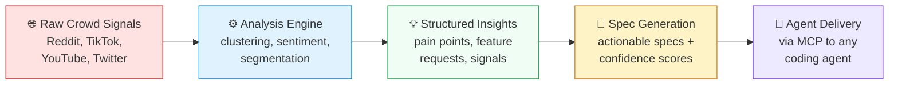

# CrowdListen

> CrowdListen은 AI 에이전트에게 크라우드 컨텍스트를 제공합니다 — 실제 사용자가 말하는 것, 시장이 생각하는 것, 커뮤니티가 원하는 것에 대한 분석된 인텔리전스입니다. 단순한 세션 기억이 아닙니다. 분석되고, 클러스터링되고, 의사결정에 바로 활용할 수 있습니다.


[English](README.md) | [中文文档](README-CN.md) | [한국어](README-KO.md) | [Español](README-ES.md)

## 문제

AI 에이전트에는 세션 메모리가 있습니다. 하지만 크라우드 컨텍스트는 없습니다. 매 세션이 처음부터 시작됩니다 — 온라인에서 청중이 실제로 무슨 말을 하는지 인지하지 못하고, 사용자들이 제품에 대해 이야기하는 플랫폼의 분석된 신호도 없습니다. 결국 컨텍스트를 반복해서 설명하고, Reddit 피드백을 수동으로 복사 붙여넣기하며, 가장 중요한 입력인 실제 사람들의 생각 없이 에이전트가 결정을 내리는 것을 지켜보게 됩니다.

CrowdListen은 리스닝에서 분석, 리콜까지의 루프로 이 격차를 해소합니다:

1. **리스닝** — Reddit, YouTube, TikTok, Twitter/X, Instagram, Xiaohongshu, 포럼 검색
2. **분석** — 주제별 의견 클러스터링, 페인 포인트 추출, 크로스 플랫폼 리포트 합성
3. **기억** — 원시 게시물이 아닌 시맨틱 임베딩과 함께 분석된 인사이트 저장
4. **리콜** — 세션과 디바이스를 넘어 자연어로 크라우드 컨텍스트를 검색

```
search_content("cursor vs claude code", platform: "reddit")
→ 20 posts with engagement metrics

cluster_opinions(content_ids)
→ 4 opinion clusters: "Cursor better for refactoring" (38%), "Claude Code better for greenfield" (31%)

save({ title: "Dev tool preferences Q2", content: <clusters>, tags: ["competitive-intel"] })
→ Stored with semantic embedding

recall({ search: "what do developers think about our product vs competitors?" })
→ Returns analyzed clusters, ranked by semantic similarity
```

모든 에이전트 — Claude Code, Cursor, Gemini CLI, Codex — 가 나중에 `recall`할 수 있습니다. 인텔리전스는 세션과 에이전트를 넘어 축적됩니다. 이것이 크라우드 컨텍스트입니다.

## 시작하기

명령어 하나면 됩니다. 브라우저가 열리고, 로그인하면 에이전트가 자동으로 설정됩니다:

```bash
npx @crowdlisten/harness login
```

**Claude Code, Cursor, Gemini CLI, Codex, Amp, OpenClaw**에 MCP가 자동 설정됩니다. 환경 변수, JSON 편집, API 키 관리가 필요 없습니다. 로그인 후 에이전트를 재시작하세요.

<details>
<summary><strong>수동 설정 (stdio)</strong></summary>

```json
{
  "mcpServers": {
    "crowdlisten": {
      "command": "npx",
      "args": ["-y", "@crowdlisten/harness"]
    }
  }
}
```
</details>

<details>
<summary><strong>원격 설정 (Streamable HTTP)</strong></summary>

```json
{
  "mcpServers": {
    "crowdlisten": {
      "url": "https://mcp.crowdlisten.com/mcp",
      "headers": {
        "Authorization": "Bearer YOUR_API_KEY"
      }
    }
  }
}
```

또는 셀프 호스팅: `npx @crowdlisten/harness serve` (포트 3848에서 시작).
</details>

### 에이전트가 도구를 점진적으로 발견합니다

시작 시 에이전트는 **5개의 코어 도구**만 봅니다 — 그 외에는 없습니다. 필요에 따라 스킬 팩을 활성화하고, 필요한 도구만 로드합니다:



재시작이 필요 없습니다 — 팩은 `tools/list_changed`를 통해 활성화되며 새로운 도구가 즉시 나타납니다.

## 할 수 있는 것

### 소셜 플랫폼 검색

하나의 도구로 Reddit, YouTube, TikTok, Twitter/X, Instagram, Xiaohongshu, Moltbook을 검색하세요. 참여 지표, 타임스탬프, 작성자 정보가 포함된 구조화된 게시물을 돌려받습니다 — 플랫폼에 관계없이 동일한 형식입니다.

```bash
# Also works as a CLI
npx crowdlisten search reddit "cursor vs claude code" --limit 5
npx crowdlisten vision https://news.ycombinator.com
```

### 청중 신호 분석

의견을 클러스터링하고, 심층 분석(청중 세그먼트, 경쟁 신호)을 실행하며, 단일 쿼리로 크로스 플랫폼 리서치 리포트를 생성합니다. 코어 추출은 무료이며 오픈 소스입니다.

### 세션 간 저장 및 리콜

에이전트는 `save`로 컨텍스트를 저장하고 `recall`로 시맨틱 검색을 통해 검색합니다. 키워드 매칭이 아닙니다. "로그인 보안을 어떻게 처리해야 하나요?"라고 물으면 이전에 JWT 토큰에 대해 작성한 메모를 찾습니다 — 단어가 겹치지 않아도 말입니다.

메모리는 Supabase에 pgvector 임베딩과 함께 저장되므로 에이전트와 디바이스를 넘어 따라옵니다. 임베딩 API를 사용할 수 없으면 키워드 매칭으로, Supabase가 다운되면 로컬 스토리지로 폴백합니다.

### 작업 계획 및 추적

에이전트는 `list_tasks`로 사용 가능한 작업을 확인하고, `claim_task`로 작업을 시작하며, `create_plan`으로 가정과 리스크를 포함한 접근 방식을 초안합니다. 결정과 학습은 `save`로 저장되어 향후 작업에서 `recall`할 수 있습니다.

### 크라우드 피드백에서 실행 가능한 스펙 얻기

전체 파이프라인: 크라우드 피드백을 분석하고, 인사이트를 추출하며, 스펙을 자동으로 생성합니다. 코딩 에이전트가 구현 준비가 된 스펙을 탐색합니다 — 각 스펙에는 실제 사용자 피드백의 근거, 인수 기준, 신뢰도 점수가 포함되어 있습니다.

### 모든 웹사이트에서 추출

비전 모드는 모든 URL의 스크린샷을 캡처하고, LLM(Claude, Gemini, 또는 OpenAI)에 전송하여 구조화된 데이터를 반환합니다. API가 없는 포럼? 댓글이 유료인 뉴스 사이트? `extract_url`을 가리키기만 하면 됩니다.

## 작동 방식




각 단계가 다음 단계에 입력됩니다. 코딩 에이전트가 `get_specs`를 호출할 때쯤이면 스펙에는 이미 실제 사용자 피드백의 근거 인용, 신뢰도 점수, 인사이트에서 도출된 인수 기준이 포함되어 있습니다.

## 스킬 팩

에이전트는 5개의 코어 도구로 시작하고 필요에 따라 팩을 활성화합니다:

| 팩 | 도구 수 | 기능 | 무료? |
|------|:-----:|-------------|:-----:|
| **core** (항상 활성) | 5 | 시맨틱 메모리, 디스커버리, 환경설정 | Yes |
| **social-listening** | 7 | Reddit, TikTok, YouTube, Twitter, Instagram, Xiaohongshu, Moltbook 검색 | Yes |
| **audience-analysis** | 6 | 의견 클러스터링, 심층 분석, 인사이트 추출, 리서치 합성 | API key |
| **planning** | 11 | 작업, 실행 계획, 진행 추적 | Yes |
| **spec-delivery** | 3 | 크라우드 피드백에서 실행 가능한 스펙 탐색 및 선점 | Yes |
| **sessions** | 3 | 멀티 에이전트 조율 | Yes |
| **analysis** | 5 | 전체 분석 실행, 결과에서 스펙 생성 | API key |
| **content** | 4 | 콘텐츠 수집, 벡터 검색 | API key |
| **generation** | 2 | PRD 생성 | API key |
| **llm** | 2 | 무료 LLM 완성 프록시 | Yes |
| **agent-network** | 3 | 에이전트 등록, 기능 디스커버리 | Mixed |

추가로 8개의 **워크플로우 팩**(competitive-analysis, content-strategy, market-research-reports, ux-researcher 등)이 활성화 시 전문 방법론 지침을 제공합니다.

매개변수 포함 전체 도구 레퍼런스: **[docs/TOOLS.md](docs/TOOLS.md)**

## 플랫폼

**즉시 사용 가능** — Reddit

**Playwright 필요** (`npx playwright install chromium`) — TikTok, Instagram, Xiaohongshu

**`.env`에 인증 정보 필요:**
- Twitter/X — `TWITTER_USERNAME` + `TWITTER_PASSWORD`
- YouTube — `YOUTUBE_API_KEY`
- Moltbook — `MOLTBOOK_API_KEY`

**비전 모드** — 다음 중 하나 필요: `ANTHROPIC_API_KEY`, `GEMINI_API_KEY`, 또는 `OPENAI_API_KEY`

**유료 분석 도구** — `CROWDLISTEN_API_KEY` (무료 도구는 없어도 작동합니다)

## 프라이버시

- LLM 호출 전 로컬에서 PII 제거
- Supabase에 행 수준 보안으로 메모리 저장 (사용자는 자신의 데이터만 접근 가능)
- Supabase 사용 불가 시 로컬 폴백
- LLM 추출에 사용자 자체 API 키 사용
- 사용자의 명시적 행동 없이 데이터 동기화 없음
- MIT 오픈 소스, 코드 검사 가능

---

<details>
<summary><strong>CLI 명령어</strong></summary>

```bash
npx @crowdlisten/harness login          # Sign in + auto-configure agents
npx @crowdlisten/harness setup          # Re-run auto-configure
npx @crowdlisten/harness logout         # Clear credentials
npx @crowdlisten/harness whoami         # Check current user
npx @crowdlisten/harness serve          # Start HTTP server on :3848
npx @crowdlisten/harness openapi        # Print OpenAPI 3.0 spec to stdout
npx @crowdlisten/harness context        # Launch skill pack dashboard
npx @crowdlisten/harness context <file> # Process file through context pipeline
npx @crowdlisten/harness setup-context  # Configure LLM provider for extraction

# Social listening CLI
npx crowdlisten search reddit "AI agents" --limit 20
npx crowdlisten comments youtube dQw4w9WgXcQ --limit 100
npx crowdlisten vision https://news.ycombinator.com --limit 10
npx crowdlisten trending reddit --limit 10
npx crowdlisten status
npx crowdlisten health
```
</details>

<details>
<summary><strong>전송 방식</strong></summary>

| 전송 방식 | 사용 사례 | 명령어 |
|-----------|----------|---------|
| **stdio** (기본값) | 로컬 에이전트 통합 | `npx @crowdlisten/harness` |
| **Streamable HTTP** | 원격/클라우드 에이전트 접근 | `npx @crowdlisten/harness serve` |
| **OpenAPI/REST** | 모든 HTTP 클라이언트 | `curl localhost:3848/openapi.json` |

HTTP 전송은 포트 3848에서 `Authorization: Bearer <token>`(Supabase JWT 또는 API 키) 인증으로 실행됩니다. 헬스 체크는 `GET /health`, OpenAPI 스펙은 `GET /openapi.json`에서 확인할 수 있습니다.
</details>

<details>
<summary><strong>설정</strong></summary>

| 변수 | 기본값 | 설명 |
|----------|---------|-------------|
| `CROWDLISTEN_URL` | `https://crowdlisten.com` | Supabase 프로젝트 URL |
| `CROWDLISTEN_ANON_KEY` | Built-in | Supabase 익명 키 |
| `CROWDLISTEN_APP_URL` | `https://crowdlisten.com` | 웹 앱 URL (로그인 리다이렉트) |
| `CROWDLISTEN_AGENT_URL` | `https://agent.crowdlisten.com` | 에이전트 백엔드 URL |
| `CROWDLISTEN_API_KEY` | None | 유료 도구용 API 키 |
</details>

<details>
<summary><strong>컨텍스트 추출</strong></summary>

채팅 기록을 업로드하면 재사용 가능한 컨텍스트 블록과 스킬 추천을 받습니다. LLM에 전달되기 전에 PII가 로컬에서 제거됩니다.

**지원 형식:** `.json` (ChatGPT/Claude 내보내기), `.zip`, `.txt`, `.md`, `.pdf`

**LLM 제공자:** OpenAI (gpt-4o-mini) 또는 Anthropic (Claude Sonnet)
</details>

<details>
<summary><strong>지원 에이전트</strong></summary>

**로그인 시 자동 설정:** Claude Code, Cursor, Gemini CLI, Codex, Amp, OpenClaw

**수동 설정으로도 사용 가능:** Copilot, Droid, Qwen Code, OpenCode

CrowdListen은 `claim_task`, `start_session`, 또는 `start_spec` 호출 시 환경 변수를 통해 실행 중인 에이전트를 자동 감지합니다.
</details>

## 개발

```bash
git clone https://github.com/Crowdlisten/crowdlisten_harness.git
cd crowdlisten_harness
npm install && npm run build
npm test    # 210+ tests via Vitest
```

에이전트가 읽을 수 있는 기능 설명과 예제 워크플로우는 [AGENTS.md](AGENTS.md)를 참조하세요.

## 기여

가장 가치 있는 기여: 새 플랫폼 어댑터(Threads, Bluesky, Hacker News, Product Hunt, Mastodon)와 추출 버그 수정.

## 라이선스

MIT — [crowdlisten.com](https://crowdlisten.com)
