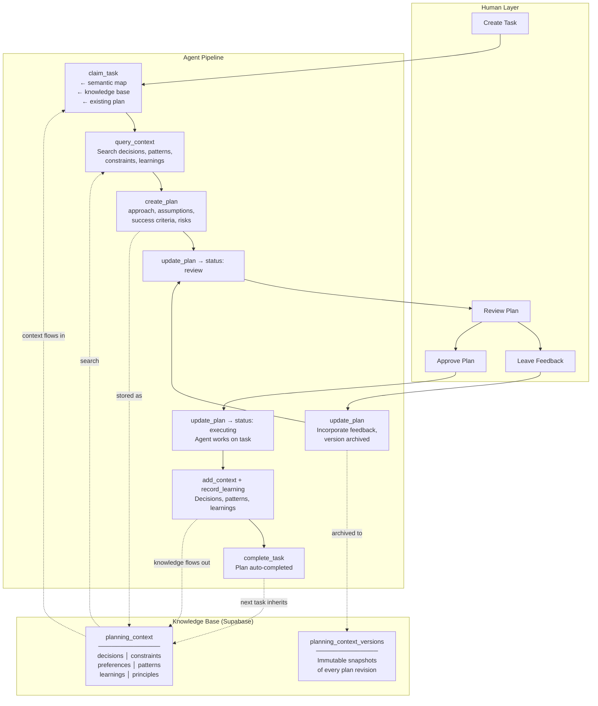

# CrowdListen Planner

> Planning and delegation system for AI agents.

## Setup

```bash
npx @crowdlisten/planner login
```

One command. Browser opens, sign in to [CrowdListen](https://crowdlisten.com), auto-configures agents. No env vars, no JSON, no API keys.

Also installs [CrowdListen Sources](https://github.com/Crowdlisten/crowdlisten_sources) for cross-channel audience signal.

## What This Does

A planning harness for AI agents -- not a task board that happens to have plans, but a planning system that happens to have tasks. Plan, get feedback, execute with context, capture learnings, and the next task is smarter. Cloud-synced knowledge base means context follows you across agents.

## Interfaces

| Interface | How to use | Best for |
|-----------|-----------|----------|
| **MCP** | Add to agent config, agents call 20 tools directly | AI agents (Claude Code, Cursor, Gemini CLI, etc.) |
| **CLI** | `npx @crowdlisten/planner login/setup/logout/whoami` | Authentication and agent configuration |

The MCP server is the primary interface — agents call tools to manage tasks, plans, and knowledge. The CLI handles login/setup only.

## Core Workflow

```
list_tasks → claim_task → query_context → create_plan → [human review] → execute → record_learning → complete_task
```

1. **list_tasks** — See what work is available
2. **claim_task** — Start work, get context (semantic map + knowledge base + existing plan)
3. **query_context** — Check existing decisions, patterns, learnings
4. **create_plan** — Draft approach, assumptions, risks, success criteria
5. **update_plan(status='review')** — Submit for human review → human approves or leaves feedback
6. **Execute** — Do the work, log_progress along the way, add_context for decisions
7. **record_learning** — Capture what you learned (promote=true for project-wide visibility)
8. **complete_task** — Mark done, plan auto-completed

Plans are optional. Quick tasks can skip straight to execution. Knowledge capture still applies.

## Tool Categories

### Core Tools (15)

**Task Management:**
| Tool | What it does |
|------|-------------|
| `list_tasks` | List tasks on the board (call first) |
| `get_task` | Full task details |
| `create_task` | Create a new task |
| `update_task` | Change title, description, status, priority |
| `claim_task` | Start work — returns context, workspace, branch |
| `complete_task` | Mark done, auto-complete plan |
| `delete_task` | Permanently remove a task |
| `log_progress` | Log a note to the execution session |

**Planning:**
| Tool | What it does |
|------|-------------|
| `create_plan` | Create execution plan (approach, assumptions, risks) |
| `get_plan` | Get plan with version history and feedback |
| `update_plan` | Iterate: update approach, status, or add feedback |

**Knowledge Base:**
| Tool | What it does |
|------|-------------|
| `query_context` | Search decisions, patterns, learnings |
| `add_context` | Write to knowledge base |
| `record_learning` | Capture outcome, optionally promote to project scope |
| `get_or_create_global_board` | Get your global board |

### Advanced Tools (3) — Parallel Sessions

| Tool | What it does |
|------|-------------|
| `start_session` | Start parallel agent session for multi-agent work |
| `list_sessions` | List sessions for a task |
| `update_session` | Update session status/focus |

### Setup Tools (2) — Board Management

| Tool | What it does |
|------|-------------|
| `list_projects` | List accessible projects |
| `list_boards` | List boards for a project |
| `create_board` | Create board with default columns |
| `migrate_to_global_board` | Move all tasks to global board |

Full parameter details: [docs/TOOLS.md](docs/TOOLS.md)

## Agent Onboarding

**Path 1 — One command (recommended):**
```bash
npx @crowdlisten/planner login
```
Opens browser, sign in, auto-configures MCP for 7 agents. Installs both Planner and Sources.

**Path 2 — Manual config:**
```json
{
  "mcpServers": {
    "crowdlisten/harness": {
      "command": "npx",
      "args": ["-y", "@crowdlisten/planner"]
    }
  }
}
```

**Path 3 — Web:**
Sign in at [crowdlisten.com](https://crowdlisten.com). Your agent can read [AGENTS.md](AGENTS.md) for tool reference.

## Architecture



### Three Layers

```
┌─────────────────────────────────────────────────┐
│  KNOWLEDGE BASE                                 │
│  Decisions, constraints, patterns, principles,  │
│  learnings — persists across all tasks           │
├─────────────────────────────────────────────────┤
│  PLANS                                          │
│  First-class artifacts with lifecycle:           │
│  draft → review → approved → executing → done   │
├─────────────────────────────────────────────────┤
│  TASKS                                          │
│  Executable work units with status tracking     │
└─────────────────────────────────────────────────┘
```

## For Agents

See [AGENTS.md](AGENTS.md) for machine-readable capability descriptions, MCP config, and example workflows.

## Supported Agents

**Auto-configured on login:** Claude Code, Cursor, Gemini CLI, Codex, Amp, OpenClaw

**Also works with (manual config):** Copilot, Droid, Qwen Code, OpenCode

## Commands

```bash
npx @crowdlisten/planner login    # Sign in + auto-configure agents
npx @crowdlisten/planner setup    # Re-run auto-configure
npx @crowdlisten/planner logout   # Clear credentials
npx @crowdlisten/planner whoami   # Check current user
```

## Development

```bash
git clone https://github.com/Crowdlisten/crowdlisten_tasks.git
cd crowdlisten_tasks
npm install && npm run build
npm test    # 210 tests via Vitest
```

## License

MIT

Part of the [CrowdListen](https://crowdlisten.com) open source ecosystem.
